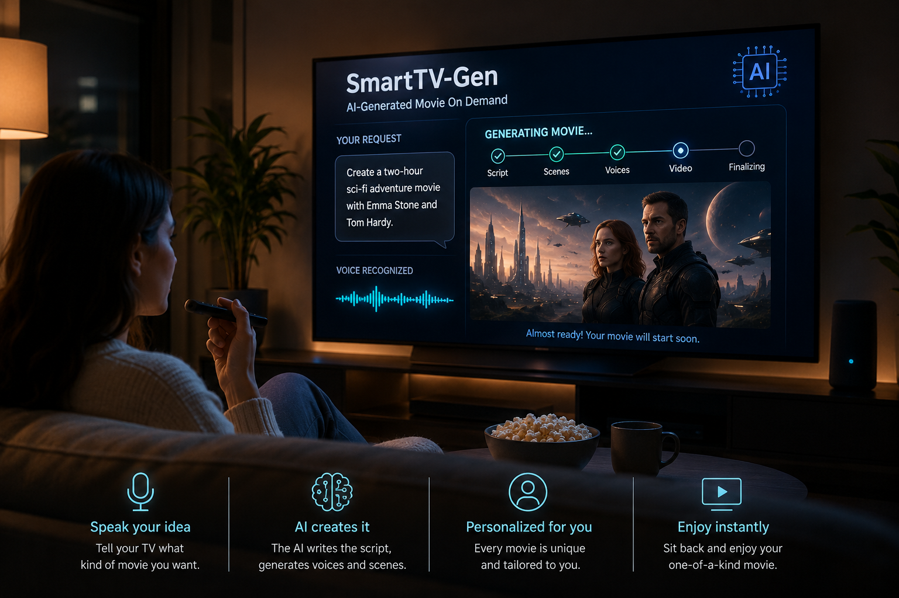

<!-- This is the markdown template for the final project of the Building AI course, 
created by Reaktor Innovations and University of Helsinki. 
Copy the template, paste it to your GitHub README and edit! -->

# Project Title

SmartTV-Gen: On‑Demand AI Movie Generator 
Building AI course project
Final project for the Building AI course
An AI concept for personalized entertainment generated in real time.

## Summary

SmartTV‑Gen explores the idea of a future TV feature where you can simply ask your TV to create a brand‑new movie for you. The user chooses the actors, genre, and length and the system generates a personalized film on the spot. 


## Background

Finding a movie that fits your taste can take a lot of time even with today’s large streaming libraries. The selection is big but still limited to what has already been produced. This project looks at how AI could make entertainment more flexible and tailored to each viewer.

Problems this idea touches on:

- It takes time to search for the “right” movie
- Limited content in certain languages or for specific groups
- Hard for children, elderly people or beginners to find suitable content
- Entertainment today is not truly personalized

Motivation
I’m interested in how AI can change everyday experiences and make technology more responsive to individual needs. Entertainment is an area where AI is developing quickly and it feels exciting to imagine what might be possible in the near future.

## How is it used?

The solution is designed for smart TVs, streaming platforms, and future AI-powered entertainment systems. The user interacts with the TV using voice commands instead of manually searching through large streaming libraries.

### Example process
1. The user turns on the smart TV.  
2. They give a voice command such as:  

> “Create a 90-minute comedy movie with two female detectives in Stockholm.”

3. The AI system analyzes the request.  
4. The system generates the script, characters, voices, scenes, and video.  
5. The movie starts playing automatically.

### Situations where the solution is useful
- Family movie nights  
- Personalized entertainment at home  
- Users who cannot easily search manually  
- People who want content in their own language  
- Fast entertainment recommendations without endless browsing  

### Target users
- Families  
- Children  
- Elderly people  
- Smart home users  
- Streaming platform users  
- People with accessibility needs  

### Important user needs
- Easy voice interaction  
- Fast response time  
- Safe and appropriate content  
- Support for multiple languages  
- Privacy protection for voice data  

---

## Example image


Example with resized image:


---

## Example code

```python
def create_movie():
    genre = input("Choose genre: ")
    actor = input("Choose actor: ")
    length = input("Movie length in minutes: ")

    print("Generating your movie...")
    print(f"Creating a {genre} movie starring {actor} with a length of {length} minutes.")

create_movie()
```

---

## Data sources and AI methods

The project would use data collected from existing movie and media databases.

### Possible data sources
- [IMDb](https://www.imdb.com/)
- [TMDb](https://www.themoviedb.org/)
- Licensed movie and video datasets
- Voice datasets for speech generation
- Public text datasets for storytelling and dialogue

### AI methods used
- Natural Language Processing (NLP)
- Speech Recognition
- Text-to-Video Generation
- Voice Cloning
- Machine Learning Recommendation Systems

### Example technologies
| Technology | Purpose |
| ----------- | ----------- |
| NLP | Understanding voice commands |
| Text-to-video AI | Generating movie scenes |
| Voice synthesis | Creating realistic voices |
| Machine learning | Personalizing recommendations |

## Challenges
- Legal issues around using real actors’ faces and voices  
- Ethical concerns related to deepfakes  
- High computational cost for generating long videos  
- Current video generation models still have quality limitations  
- The system must include strong safety filters to avoid inappropriate content  

## What next?

- Start by generating short clips instead of full movies  
- Use fictional, AI-created actors to avoid copyright issues  
- Build a simple prototype as a mobile or web app  
- Improve video quality and consistency  
- Collaborate with people in film, design, and AI development  


## Acknowledgments

This project was inspired by recent developments in generative AI, especially text-to-video models, voice synthesis, and AI-generated media.
Some useful sources and inspirations include:

### Generative video and language models
- Text-to-Video Generation Survey (arXiv)
- State of Open Video Generation Models (Hugging Face)

### Open-source AI tools
- Hugging Face Diffusers
- Research on GANs, VAEs, and diffusion models

### AI and the future of media
- Generative AI for Text-to-Video: Future Directions
- Research discussions about ethics and AI-generated media

I also want to acknowledge the wider AI community for ongoing discussions about creativity, ethics, and the future of digital entertainment.
